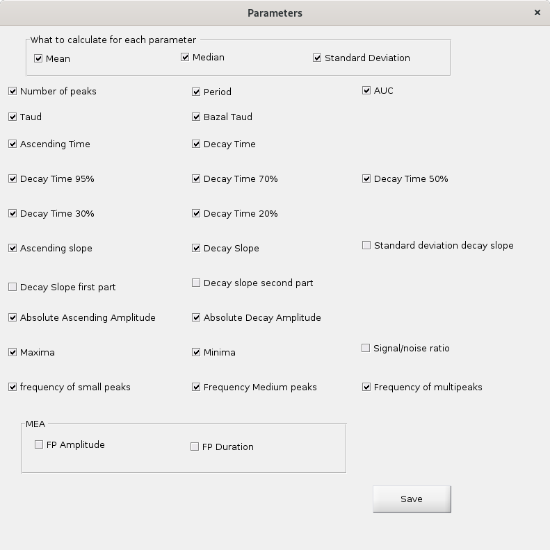

# CalDyn: a tool for an automatic calcium dynamics characterization

We give here a quick description on how to use the software, for further details, please refer to:
"CalDyn: An advanced high-throughput automated algorithm for monitoring intracellular calcium dynamics and electrophysiological signals in patient-derived cells".... to be cited

## Examples
A Graphical User Interface (gui) is launched running the file CalDyn_*.m in Matlab.

There exists different versions of this file which have been finely tuned for different signals (The one presented in the article previously mentionned). We also provide here a set of excel files for testing.  But for a new analysis, any of them can be launched and the user is invited to create its own starting file once conditions have been chosen for a given experiment to make the analysis even faster.

## Let's start
In this file, the user will have to set the path to the excel file to be analyzed (folder variable). All results will be saved in the very same folder, in subfolders having the same name as the original excel file.

See below for a list of the parameters that can be set in the gui either at startup or also directly using the interface.

The GUI should look like:

In [A], the signal is plotted in light grey, and in blue, the filtered signal is represented. This latter signal is the one on which everything will be calculated, so it should be faithful to the original signal but with less noise, as depicted here (The filtering could be adjusted in box [1], the higher the value, the higher the filtering).
In [A], all the results from the peak detection algorithms are represented in colored crosses. Black ones represent the maxima and minima associated with each peak. Cyan ones are the starting points of the peak and green ones their finishing points. Magenta crosses are points taking along the decrease in signal corresponding to 0.8, 0.7 0.5 0.3 and 0.05 times the height of the initial signal.

The detection of the peak is made using the derivative of the signal searching for a couple of minimum/maximum above a threshold (corresponding to the rise and fall associated to each peak). The derivative of the signal is represented in red of box [B], the signal undergoes a new filtering step which can be adjusted using the smooth_length box [2].
The most important parameter to be set is the threshold in box [3] (value between 0 and 1), it will set the dotted line represented in [B], above which the derivative maxima/minima will be searched. If this parameter is set to low, we will mainly detect the noise in the signal, if set to high, we will miss some peaks.
If parameters of the peaks are not detected properly, it is usually because the derivative of the signal is still very noisy and should be smoothed further by increasing the number in box [2].

There is a possibility to manually remove peaks using [5] and clicking near the peak which needs to be erased.

It is also possible to remove the base line using [4] (The base line can be fitted either using a constant or a polynomial of degree 1 or 2). See below the result on the initial signal:

If the box Ref=base line is checked, all the minima of the signals will be set to zero.

There is also an option for peaks classification (the panel corresponding to this option can be made apparent clicking on button [7]). Three thresholds will need to be set to classify the peaks between small medium and high, and also to detect multipeaks (peaks which will not go down to the base line before rising again). If the classification option is set to 'on', then in the excel file where the results are saved, there will be now 4 different sheets: Sheet 1 will gather statistics on all peaks, whereas sheets 'small_peaks', 'medium_peaks', 'large_peaks' will gather respectively statistics on small, medium and
large peaks only.

Saved Parameters can be set using button [6], a new checkbox menu will appear on which the user will be able to choose the parameters he will want to save:

## Saved parameters:
Below is a description of all the different parameters that can be saved and their definition:

$\tau_c$ corresponds to the ascending time.
$\tau_r$ corresponds to the decay time.
$\tau_d$ corresponds to the diastole time (time before the next peak).

For all the following parameters, the user can decide to save the mean and/or median and/or standard deviations. A list of the parameters to be saved, can be either given at startup or chosen via the button [8] of the GUI.

+ 'N_pks': Number of detected peaks
+ 'Period': Time $T$ in between peaks
+ 'f_smpks': frequency of small peaks
+ 'f_medpks': frequency of medium peaks
+ 'f_multipks': frequency of multipeaks
+ 'Sig_noise': Signal (amplitude of the peaks) over noise (90th centile of the absolute value of the base line minus its average)
+ 'Asc_time': Duration of the contration ($\tau_c$ on figure)
+ 'Decay_time': Duration of the relaxation ($\tau_r$ on figure)
+ ‘Decay_time_95': Time to relax 95% of the peak amplitude
+ 'Decay_time_90': Time to relax 70% of the peak amplitude
+ 'Decay_time_80': Time to relax 70% of the peak amplitude
+ 'Decay_time_70': Time to relax 70% of the peak amplitude
+ 'Decay_time_50': Time to relax 50% of the peak amplitude
+ 'Decay_time_30': Time to relax 30% of the peak amplitude
+ 'Decay_time_20': Time to relax 20% of the peak amplitude, 
+ 'Taud': time between the end of a peak and the beginning of the next one ($\tau_d$ on figure)
+ 'Baz_taud': $\frac{\tau_d}{\sqrt{T}}$
+ 'AUC': Area under curve (peak)
+ 'Ascending slope': Slope of the signal during the rising phase in a peak
+ 'Decay slope': Slope of the signal during the decay phase in a peak
+ 'Decay_slope_0_50': Average of the decaying slope in the first half of the peak
+ 'Decay_slope_50_100': Average of the decaying slope in the second half of the peak
+ 'Std_decay_slope': Standard deviation of the slope of the decaying part (interesting parameter when the peak is not triangular)
+ 'Amp_asc': Amplitude of the ascending part of the peak
+ 'Amp_decay': Amplitude of the decaying part of the peak (may not be the same than the previous value if the signal do not fall back to base line)
+ 'Maxima': Values of the maxima of the peaks
+ 'Minima': Values of the minima of the peaks

## Input Parameters and their default values
### Filtering parameters
Data are filtered using a Savitzky-Golay scheme, which uses two parameters
+ ('param_filter', 111): number of points on which the filtering polynomial will be applied, the number will depend on the temporal resolution and the level of noise in the data. Its value should be higher than the polynomial order below.
+ ('Pol_order', 2): Polynomial order of the filter

Before taking the derivative and detecting peaks, a second round of filtering is used, controlled by the parameter:
+ (‘Smoothness', 200): size of the filtering kernel
For MEA signal, a different filtering scheme is applied, based on the Fourier transform of the signal, and all values above a cutoff frequency will be put to zero
+ ('Cut_freq', 20): cutoff frequency

### Detection parameters
To detect peaks, we search for couple of maxima/minima in the derivatives, which will be above a certain proportion of the maximum/minimum of the derivative (see article for a proper definition)
+ ('proportion', 0.1): value between 0 and 1.

### Peak Classification
+ ('Pks_class', 0): boolean to indicate if peak classification should be done
+ ('th_smpks', 0.2): threshold to separate small peaks from the others
+ ('th_medpks', 0.5): threshold to separate medium peaks from large one
+ ('th_multi', 0.2): threshold to identify multipeaks (i.e. peaks were the signal does not go back to base line before a new peak starts)
See Ref article, for a precise description on how threshold are used.
### Baseline
+ (‘baselinefit', 0): boolean to allow baseline calculus and substraction
+ ('bool_baselineref',0): boolean to decide if all minima in the curves are set to zero or not

