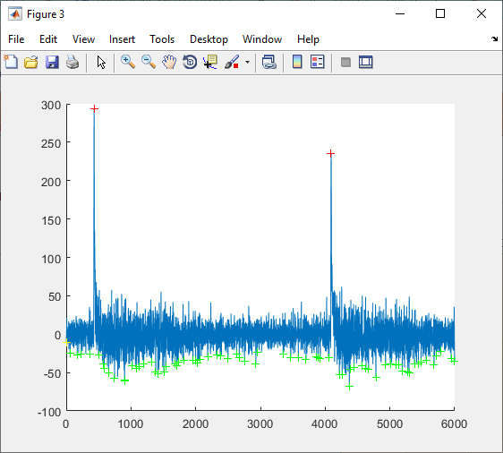

Parameters obtained from the derivative of the signal:

In red, (locc,maxc)
In green, (locr,minr)

Here in the example there are too many minima detected so the smooth length should be set higher.

So when maxima are not well located, just adjust the smooth_length parameter!!!
